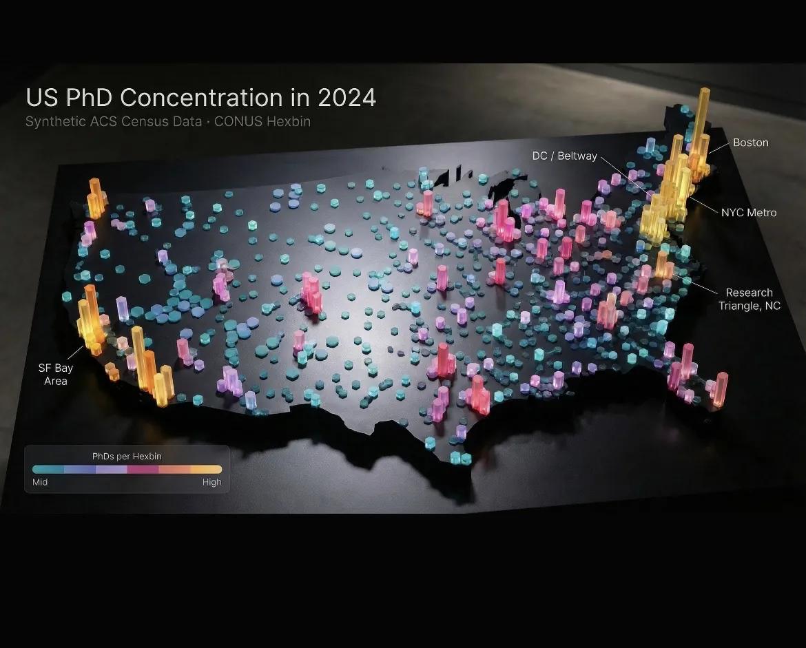

# 3D Hexbin Spring Map

A single self-contained HTML file that renders 376 hexagonal bins as extruded 3D
columns over a dark basemap, with each column running its own damped harmonic
oscillator. Move the cursor and columns within 160 px spring upward and settle back
with real overshoot; on load they cascade west-to-east like dominoes. Built on
MapLibre GL JS 4.7.1 with no framework, no build step and no npm install — the
whole thing is one file you can open by double-clicking it.

Built to learn what `feature-state` makes possible. Updating a per-feature paint
property every frame, instead of resending GeoJSON, is what turns a static
extrusion map into something with physics in it.



*Placeholder still — and this is the project that most needs motion, since the springs and the intro wave are the entire point. A demo GIF replaces this.*

---

## How it works

| Piece | Mechanism |
|---|---|
| **Hex grid** | Offset-coordinate binning; `col % 2` row shift produces the interlocking honeycomb |
| **3D columns** | MapLibre `fill-extrusion`, height and colour both driven by the bin value |
| **Animation channel** | `feature-state` — per-feature height updated per frame without touching the source |
| **Physics** | One damped harmonic oscillator per hex, stepped in a `requestAnimationFrame` loop |
| **Hover** | Screen-space proximity: `map.project()` each centre, boost by squared falloff inside the radius |
| **Intro wave** | Per-hex delay derived from longitude, so activation sweeps west to east |

Tuned constants, as shipped:

```javascript
const K = 0.32;     // stiffness — higher is snappier
const D = 0.58;     // damping — lower is bouncier
const BOOST = 3.5;  // hover height multiplier
const RAD = 160;    // effect radius, screen pixels
```

**The details that would have made it wrong:**

- **Springs, not lerps.** `curH += 0.1 * (target - curH)` is smooth and lifeless.
  A damped oscillator overshoots and settles, and the overshoot is the entire
  reason it reads as physical rather than as an easing curve.
- **Proximity is measured in screen space, not map space.** Projecting each hex
  centre per frame sounds expensive; it is not, and it is the only version that
  behaves correctly, because a fixed-degree radius would change apparent size
  every time you zoom.
- **`Float64Array`, not plain arrays**, for height, velocity and base height. The
  JIT compiles typed-array access close to native, which is what holds 60 fps
  while stepping several hundred oscillators.
- **The falloff is squared** (`prox * prox`), not linear. Linear falloff makes the
  whole neighbourhood rise as a slab; squared makes a peak with shoulders.
- **Only push state when it changed.** Guarding `setFeatureState` on a velocity or
  delta threshold stops the loop writing hundreds of no-op updates once the field
  has settled.

A full walkthrough with the code for each stage is in
**[docs/BUILD-GUIDE.md](docs/BUILD-GUIDE.md)**.

---

## Quickstart

```bash
open index.html
```

That is the whole install. There is no build step and no package manager.

The file needs network access at runtime for two CDN-hosted things: the MapLibre
GL JS library and the CartoDB basemap tiles. Everything else — the hex geometry
and its values — is embedded in the file.

---

## Controls

| Action | Input |
|---|---|
| Pan | Left-drag |
| Rotate / tilt | Right-drag, or Ctrl+drag |
| Zoom | Scroll |
| Spring hover | Move the cursor over the hexes |

---

## Making it yours

Replace the embedded GeoJSON. Each feature needs:

- a numeric property used for both colour and height,
- hexagonal polygon geometry,
- a **sequential numeric `id`** — `feature-state` is keyed on it, and the physics
  arrays are indexed by it, so gaps or string ids will break the animation.

The spring pattern is not specific to hexagons. Any `fill-extrusion` source works:
census tracts, ZIP codes, H3 cells, OSM building footprints.

---

## Project layout

```
index.html          the entire application — geometry, physics and styling
docs/
  BUILD-GUIDE.md    stage-by-stage walkthrough of how it was built
  hero.webp         still frame (placeholder for a demo GIF)
hero-images/        cover art renders, 38 MB — presentation, not used by the app
```

---

## Limits

**The data is synthetic.** The columns are synthetic ACS-Census-style PhD
concentration figures generated for the demo, clipped to the continental US. The
map's own footer says so. Nothing here is a finding about where doctorates
actually cluster — the exercise was the interaction, not the estimate.

**"Zero dependencies" means no build step, not offline.** MapLibre loads from a
CDN and the basemap tiles come from CartoDB, so the file needs a network
connection. Genuinely offline use means vendoring the library and swapping in a
local raster or vector source.

**376 hexes is comfortable; several thousand would not be.** The loop projects and
steps every hex every frame. It has headroom at this size and would need spatial
culling — stepping only hexes near the cursor — before it scaled by an order of
magnitude.

**Hex size is fixed in degrees.** Bins are therefore not equal-area, and cells in
the north of the CONUS extent cover less ground than cells in the south. At this
scale and for a demonstration it is not visible, but it would matter for any real
density claim.

**No GitHub Pages yet.** The file runs locally; a live link requires enabling Pages
on this repo (Settings → Pages → main branch).

---

## Stack

MapLibre GL JS 4.7.1 · CartoDB dark basemap · vanilla JavaScript · `Float64Array`
for the physics state. MIT licensed.
